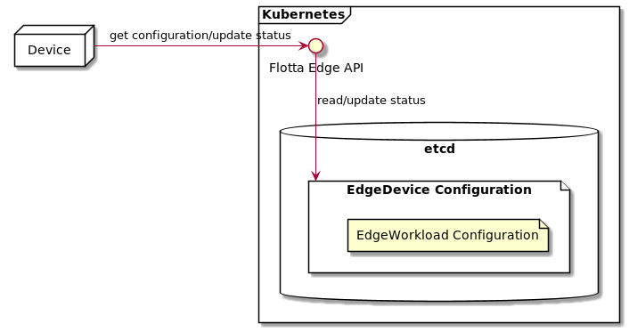
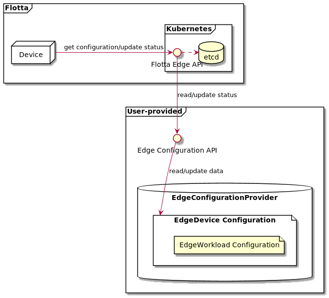

# Remote data store for Flotta Edge API

## Introduction

By default Flotta Edge API uses Kubernetes and CRD-based storage as a source of truth about managed Edge entities -
`EdgeDevice` and `EdgeWorkload`. All the other CRDs serve as support for better device fleet management in Kubernetes
environment.



Users might want to store their device configuration data in some other place than Kubernetes etcd. To support that
use-case we provide a way to use that external data store (or to be precise - data provider service) in Flotta Edge API.

On the diagram below you can see *Flotta Edge API* still providing data to a *Device* in the same way as it is happening
now. The difference is that Device configuration (including workload definitions) is read from an external service
represented by *Edge Configuration API*, which in turn uses its own data store - *EdgeConfigurationProvider*. It is
responsible for providing said Device configuration in format defined by Flotta. The heartbeat messages will be sent to
*Edge Configuration API* as well. *etcd* on the diagram is used only for storing objects being under supervision of
*Flotta Edge API*, like Secrets with mTLS certificates used for *Device-Flotta Edge API* communication.

**Warning!**

*Flotta Operator can't use custom, external data store and its functionality, if needed, has to be implemented by the
users*



## Flotta Edge API configuration for remote data store

### Prerequisites

* HTTP service
  providing [Edge Configuration API](./operations/configuration-api.html).
  You can take inspiration from
  our [integration test](https://github.com/project-flotta/flotta-operator/blob/main/internal/edgeapi/backend/remote/backend_integration_test.go)
  and
  a [fake server implementation](https://github.com/project-flotta/flotta-operator/blob/main/internal/edgeapi/backend/remote/fake-server_test.go)
  ;
* Flotta Edge API deployed - as part of the whole Flotta deployment or a standalone deployment (Flotta operator would be
  useless);
* Edge Configuration API server has to be reachable from Flotta Edge API pod;

### Flotta Edge API configuration

Flotta Edge API configuration can be found in `flotta-edge-api-config` ConfigMap in `flotta` namespace. To configure
remote storage, you need to set following properties in that config map:

```
BACKEND=remote
REMOTE_BACKEND_URL=<URL to your Edge Configuration API server>
```

You can optionally set `REMOT_BACKEND_TIMEOUT=<duration>` to specify timeout on Edge Configuration API HTTP requests.

If you want to protect your Edge Configuration API with mTLS, you need to use Flotta CA to sign your server certificate
and verify client certificate against the same CA. Flotta CA is stored in `flotta-ca` Secret in `flotta` namespace.
Flotta will be using client certificate stored in `flotta-host-certificate` Secret in `flotta` namespace. mTLS will
turned automatically on if your `REMOTE_BACKEND_URL` uses `https`.


After Flotta Edge API pod is restarted, it will be using your new configuration.